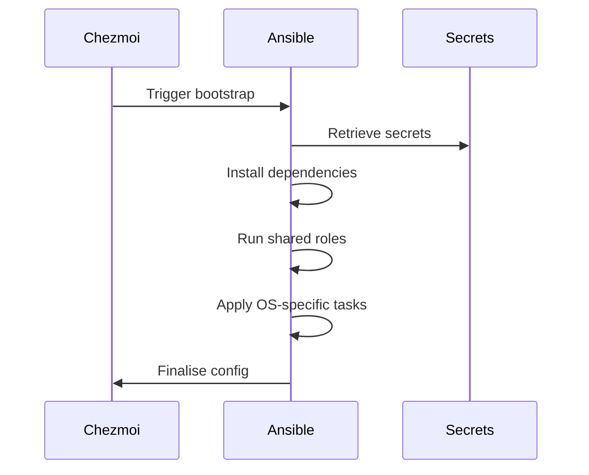

# 🧰 Cross-Platform Dotfiles

[](https://opensource.org/license/mit/)
[](https://www.chezmoi.io)
[](https://www.ansible.com)
[](https://docusaurus.io)

---

## 🔧 Unified Architecture: chezmoi + Ansible

* Valid across large-scale environments
* Aligned with SOC 2 and ISO 27001 practices
* Optimised for fast onboarding
* Built with modular, per-platform tasks

---

## 🌟 Key Improvements

### 1. Cleaner Ansible Structure

```text
ansible/
└── playbooks/
    ├── ubuntu/
    ├── windows/
    ├── arch/
    ├── darwin/
    └── wsl/
```

Each platform includes a `requirements.yml` file to isolate dependencies.

### 2. Secure Secret Separation

```text
secrets/
├── chezmoi/          # Dotfile secrets
└── ansible-vault/    # Provisioning secrets
```

### 3. Modular Task Layout

```text
playbooks/ubuntu/tasks/
├── apt.yml
├── snap.yml
└── security.yml
```

---

## 🖥 Platform Matrix

| OS            | Playbook Path                | Dependencies Path                    | Modules Example              |
| ------------- | ---------------------------- | ------------------------------------ | ---------------------------- |
| macOS         | `playbooks/darwin/main.yml`  | `playbooks/darwin/requirements.yml`  | Homebrew, defaults, security |
| Windows       | `playbooks/windows/main.yml` | `playbooks/windows/requirements.yml` | Chocolatey, WinRM, Defender  |
| Ubuntu/Debian | `playbooks/ubuntu/main.yml`  | `playbooks/ubuntu/requirements.yml`  | APT, Snap, kernel            |
| Arch Linux    | `playbooks/arch/main.yml`    | `playbooks/arch/requirements.yml`    | pacman, AUR, systemd         |
| WSL           | `playbooks/wsl/main.yml`     | `playbooks/wsl/requirements.yml`     | Hybrid integration           |

---

## 🔐 Security Features

### Dual Vault System

```bash
# Chezmoi secrets
chezmoi add --encrypt ~/.ssh/id_rsa

# Ansible secrets
ansible-vault encrypt secrets/ansible-vault/prod.yml
```

### Task-Level Controls

```yaml
- name: Apply CIS benchmarks
  include_tasks: tasks/cis.yml
  when: security_hardening_enabled
```

### Audit-Ready Layout

* `test/` directory for validation
* Molecule scenarios to test roles

---

### Smart Defaults

```yaml
package_managers:
  windows: winget
  debian: apt
  darwin: brew
  arch: pacman
```

### Compliance-as-Code

* CIS baselines included
* Optional Lynis and OpenSCAP scans
* Auditd and WEF templates

---

## 🛠 Toolchain

| Layer           | Component               | Purpose                  |
| --------------- | ----------------------- | ------------------------ |
| Configuration   | Ansible 2.15+           | Declarative provisioning |
| OS Provisioning | Platform tasks          | Dependency isolation     |
| Testing         | Molecule 4+             | Role checks              |
| Secrets         | Ansible Vault + chezmoi | Encrypted workflows      |
| CI/CD           | GitHub Actions          | Automated pipelines      |

---

## 🧬 Architecture

### Provisioning Flow



---

## 🚀 Quickstart

### 1. Install chezmoi

```bash
sh -c "$(curl -fsLS get.chezmoi.io)"
```

### 2. Initialise

```bash
chezmoi init https://github.com/hetfs/dotfiles
```

### 3. Apply

```bash
chezmoi apply
```

### 4. Provision OS

```bash
cd ansible
ansible-galaxy install -r playbooks/ubuntu/requirements.yml
ansible-playbook playbooks/ubuntu/main.yml
```

---

## 🧩 Utilities

| Tool     | Description                |
| -------- | -------------------------- |
| Taskfile | Cross-platform task runner |
| direnv   | Auto environment loader    |
| step-cli | Certificate management     |
| Trivy    | Security scans             |

---

## 📜 Governance

* License: [MIT](https://opensource.org/license/mit/)
* CIS-ready structure
* Quarterly secret rotation
* Contributions welcome: `CONTRIBUTING.md`
