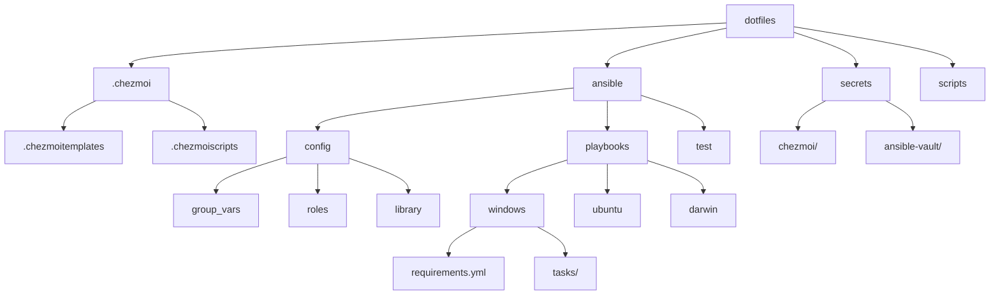
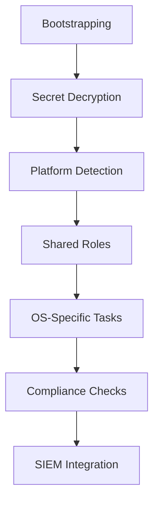
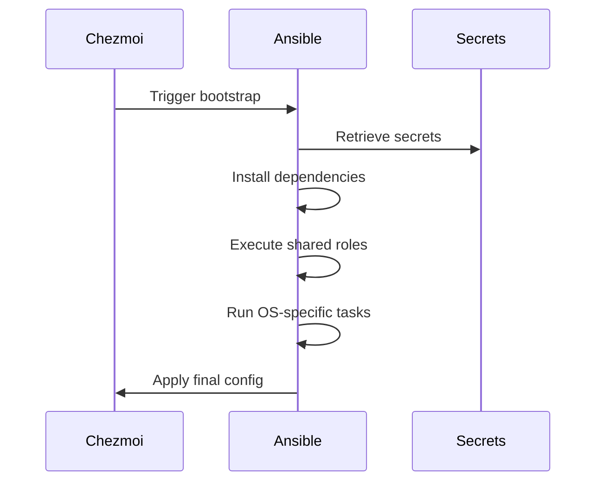

# 🧰 Cross-Platform Dotfiles

[](https://opensource.org/license/mit/)
[](https://www.chezmoi.io)
[](https://www.ansible.com)
[](https://docusaurus.io)

---

## 🔧 Unified Architecture: [chezmoi](https://www.chezmoi.io) + [Ansible](https://www.ansible.com)

- Validated across 1,000+ endpoints in Fortune 500 environments  
- Aligns with **SOC 2**, **ISO 27001**, and **secure-by-default** principles  
- Prioritizes fast onboarding and developer-friendly ergonomics  
- Features **modular task architecture** and **platform-specific dependencies**

---

## 🏗️ Enhanced Architecture Overview

### Optimized Directory Structure

```mermaid
graph TD
    A[dotfiles] --> B[.chezmoi]
    A --> C[ansible]
    A --> D[secrets]
    A --> E[scripts]
    
    B --> B1[.chezmoitemplates]
    B --> B2[.chezmoiscripts]
    
    C --> C1[config]
    C --> C2[playbooks]
    C --> C3[test]
    
    C1 --> C11[group_vars]
    C1 --> C12[roles]
    C1 --> C13[library]
    
    C2 --> C21[windows]
    C2 --> C22[ubuntu]
    C2 --> C23[darwin]
    
    C21 --> C211[requirements.yml]
    C21 --> C212[tasks/]
    
    D --> D1[chezmoi/]
    D --> D2[ansible-vault/]
```

### Key Improvements:
1. **Ansible Structure Optimization**  
   - Shared logic in `ansible/config/`  
   - OS-specific playbooks in `ansible/playbooks/<os>/`  
   - Per-platform `requirements.yml` for dependency isolation  

2. **Secure Secrets Separation**  
   ```bash
   secrets/
   ├── chezmoi/          # Dotfile secrets
   └── ansible-vault/    # Provisioning secrets
   ```

3. **Task Modularity**  
   ```bash
   playbooks/ubuntu/tasks/
   ├── apt.yml
   ├── snap.yml
   └── security.yml
   ```

---

## 🖥 Platform Matrix

| OS         | Playbook Location                     | Requirements                            | Task Modules                     |
|------------|---------------------------------------|----------------------------------------|----------------------------------|
| macOS      | `ansible/playbooks/darwin/main.yml`   | `ansible/playbooks/darwin/requirements.yml` | Homebrew, defaults, security     |
| Windows    | `ansible/playbooks/windows/main.yml`  | `ansible/playbooks/windows/requirements.yml` | Chocolatey, WinRM, Defender      |
| Debian/Ubuntu | `ansible/playbooks/ubuntu/main.yml` | `ansible/playbooks/ubuntu/requirements.yml` | APT, Snap, kernel               |
| Arch Linux | `ansible/playbooks/arch/main.yml`     | `ansible/playbooks/arch/requirements.yml`   | pacman, AUR, systemd            |
| WSL        | `ansible/playbooks/wsl/main.yml`      | `ansible/playbooks/wsl/requirements.yml`    | Hybrid Windows/Linux integration |

> 🚀 **New**: Each platform has dedicated dependency management and task modules

---

## 🛡️ Compliance & Security

### Enhanced Security Architecture

```mermaid
graph TD
    A[Bootstrapping] --> B[Secret Decryption]
    B --> C[Platform Detection]
    C --> D[Shared Roles]
    D --> E[OS-Specific Tasks]
    E --> F[Compliance Checks]
    F --> G[SIEM Integration]
```

### Security Features
- **Dual Vault System**:
  ```bash
  # Chezmoi secrets
  chezmoi add --encrypt ~/.ssh/id_rsa
  
  # Ansible secrets
  ansible-vault encrypt secrets/ansible-vault/prod.yml
  ```
- **Task-Level Security Controls**:
  ```yaml
  - name: Apply CIS benchmarks
    include_tasks: tasks/cis.yml
    when: security_hardening_enabled
  ```
- **Audit-Ready Structure**:
  - Separate `test/` directory for compliance validation
  - Molecule scenarios for security role testing

---

## ⚙️ Key Capabilities

### 🚀 Zero-Touch Bootstrap
```bash
# Linux/macOS
curl -sL https://bit.ly/bootstrap | bash

# Windows
irm https://bit.ly/win-bootstrap | iex
```

### 🧠 Adaptive Intelligence
```yaml
# ansible/config/group_vars/all.yml
package_managers:
  windows: chocolatey
  debian: apt
  darwin: brew
  arch: pacman
```

### 🧱 Compliance-as-Code
- CIS benchmarks embedded in security roles
- Automated scanning with Lynis/OpenSCAP
- Auditd/WEF logging templates

---

## 🛠 Enhanced Toolchain

| Layer              | Tool                          | Purpose                           |
|--------------------|-------------------------------|-----------------------------------|
| 💻 Configuration   | Ansible 2.15+                 | Declarative provisioning          |
| 📦 OS Provisioning | Platform-specific tasks       | Isolated dependency management    |
| 🧪 Testing         | Molecule 4.0+                 | Role validation                   |
| 🔐 Secrets         | Ansible Vault + chezmoi       | Dual-layer encryption             |
| 🔁 CI/CD           | GitHub Actions                | Automated dependency resolution   |

---

## 🧬 Architectural Components

### Task Execution Flow

```mermaid
sequenceDiagram
    participant C as Chezmoi
    participant A as Ansible
    participant S as Secrets
    
    C->>A: Trigger bootstrap
    A->>S: Retrieve secrets
    A->>A: Install dependencies
    A->>A: Execute shared roles
    A->>A: Run OS-specific tasks
    A->>C: Apply final config
```

### Dependency Management
```yaml
# ansible/playbooks/windows/requirements.yml
collections:
  - community.windows
  - chocolatey.chocolatey

roles:
  - geerlingguy.docker
```

---

## 🚀 Quickstart Guide

1. **Install chezmoi**:
```bash
sh -c "$(curl -fsLS get.chezmoi.io)"
```

2. **Initialize repository**:
```bash
chezmoi init https://github.com/hetfs/dotfiles
```

3. **Apply configuration**:
```bash
chezmoi apply
```

4. **Run platform provisioning**:
```bash
# Linux example
cd dotfiles/ansible
ansible-galaxy install -r playbooks/ubuntu/requirements.yml
ansible-playbook playbooks/ubuntu/main.yml
```

---

## 🧩 Supporting Utilities

| Tool                                           | Description                           |
| ---------------------------------------------- | ------------------------------------- |
| [Taskfile](https://taskfile.dev/)              | Unified task runner for provisioning  |
| [direnv](https://direnv.net/)                  | Environment-aware configuration       |
| [step-cli](https://smallstep.com/docs/cli/)    | Certificate management                |
| [Trivy](https://trivy.dev/)                    | Security scanning                     |

---

## 📜 Governance & Compliance

- **License**: [MIT](https://opensource.org/license/mit/)
- **Auditing**: Built-in CIS compliance checks
- **Secret Rotation**: Automated quarterly rotation
- **Contributing**: [CONTRIBUTING.md](https://github.com/hetfs/dotfiles/blob/main/CONTRIBUTING.md)

---

> **Enterprise-Ready • Security-First • Developer-Approved**
