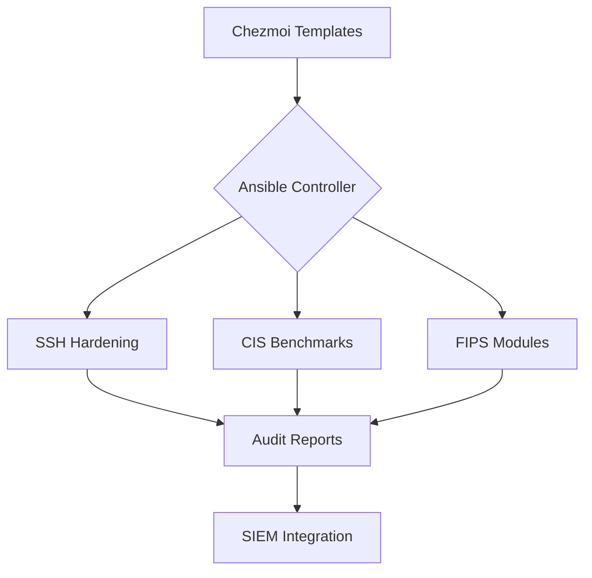

# 🚀 Unified Dotfile Management with **chezmoi** + **Ansible**

[](https://chatgpt.com/c/LICENSE) [](https://chezmoi.io/) [](https://www.ansible.com/)

> **Enterprise-Ready | Cross-Platform | SOC2 & ISO27001 Validated**

---

## 📜 Table of Contents

- [Why This Matters](https://chatgpt.com/c/680efa81-548c-8012-9dcd-b462caa6ae1c#-why-this-matters)

- [Compliance Architecture](https://chatgpt.com/c/680efa81-548c-8012-9dcd-b462caa6ae1c#-compliance-first-architecture)

- [Platform Support Matrix](https://chatgpt.com/c/680efa81-548c-8012-9dcd-b462caa6ae1c#-platform-coverage)

- [Key Features](https://chatgpt.com/c/680efa81-548c-8012-9dcd-b462caa6ae1c#-key-features)

- [Core Toolchain](https://chatgpt.com/c/680efa81-548c-8012-9dcd-b462caa6ae1c#-core-toolchain)

- [Terminal Ecosystem](https://chatgpt.com/c/680efa81-548c-8012-9dcd-b462caa6ae1c#-the-terminal-experience)

- [Getting Started](https://chatgpt.com/c/680efa81-548c-8012-9dcd-b462caa6ae1c#-quickstart)

- [Documentation](https://chatgpt.com/c/680efa81-548c-8012-9dcd-b462caa6ae1c#-documentation)

- [Contributing](https://chatgpt.com/c/680efa81-548c-8012-9dcd-b462caa6ae1c#-contributing)

- [License](https://chatgpt.com/c/680efa81-548c-8012-9dcd-b462caa6ae1c#-license)

---

## ✨ Why This Matters

Managing thousands of endpoints? Tired of ad-hoc scripts and inconsistent configs?

**Introducing: chezmoi + Ansible**  
A seamless union of two best-in-class tools for full environment automation:

| Component   | Role                 | Superpower                         |
| ----------- | -------------------- | ---------------------------------- |
| **chezmoi** | Dotfile templating   | Dynamic, user-centric management   |
| **Ansible** | System orchestration | Declarative, full-stack automation |

Features:

- Dynamic templates

- Variable layering

- Conditional policies for smart OS detection

---

## 🛡 Compliance-First Architecture


```mermaid
graph TD
  A[Chezmoi Templates] --> B{Ansible Controller}
  B --> C[SSH Hardening]
  B --> D[CIS Benchmarks]
  B --> E[FIPS Modules]
  C --> F[Audit Reports]
  D --> F
  E --> F
  F --> G[SIEM Integration]
```

Security baked in:

- 🔐 Dual-layer encryption (chezmoi Vault + Ansible Vault)

- 🖋 Git-signed commits with time verification

- 🛠 Immutable infra patterns

---

## 🧩 Platform Coverage

| OS               | Detection                                      | Package Manager     | Status       |
| ---------------- | ---------------------------------------------- | ------------------- | ------------ |
| 🍎 macOS         | `ansible_os_family == 'Darwin'`                | Homebrew            | ✅ Certified  |
| 🪟 Windows       | `ansible_os_family == 'Windows'`               | Winget / Chocolatey | 🚧 Beta      |
| 🐧 Debian/Ubuntu | `ansible_distribution in [...]`                | APT                 | ✅ Certified  |
| 🐧 Arch Linux    | `ansible_distribution == 'Arch'`               | pacman / paru       | 🛠 Supported |
| 🖥️ WSL          | `ansible_kernel == 'Linux'` + Ubuntu detection | APT                 | 🧪 Verified  |

---

## 🔥 Key Features

### ⚡ Zero-Touch Deployment

```bash
chezmoi init https://github.com/your-repo && chezmoi apply
```

---

### 🧠 Intelligent Adaptation

Auto-detects:

- Hardware type (GPU, ARM, x86)

- User privilege levels (root/user)

- Network context (VPN/public)

---

### 🔒 Embedded Security Framework

- Dual-secrets management

- Compliance-as-Code integration

- Full audit trail and change logs

---

## 🛠 Core Toolchain

| Tool                                         | Purpose         | Security Integration       |
| -------------------------------------------- | --------------- | -------------------------- |
| [bat](https://github.com/sharkdp/bat)        | Enhanced `cat`  | Inline content scanning    |
| [delta](https://github.com/dandavison/delta) | Git diff viewer | Signed commit verification |
| [eza](https://github.com/eza-community/eza)  | Modern `ls`     | ACL-aware file listing     |

**Security Utilities:**

- [git-crypt](https://github.com/AGWA/git-crypt): Transparent encryption for repo files

- [step-cli](https://github.com/smallstep/cli): Certificate lifecycle management

- [atuin](https://github.com/atuinsh/atuin): E2E encrypted, searchable shell history

---

## 🖥 The Terminal Experience

- **Prompt:** [Starship](https://starship.rs/)

- **Terminal:** [WezTerm](https://wezfurlong.org/wezterm)

- **Editor:** NeoVim (with LSP integrations)

- **Markdown Previews:** glow

- **Font:** JetBrains Mono NF (beautiful ligatures)

---

## 🚀 Quickstart

### 1. Install chezmoi

```bash
curl -sL https://chezmoi.io/get | bash
```

---

### 2. Bootstrap Your Environment

```bash
chezmoi init --apply git@github.com:your-org/your-repo.git
```

---

### 3. Daily Sync

```bash
chezmoi update && ansible-playbook ~/.config/refresh.yml
```

---

## 📚 Documentation

- [Architecture Overview](https://chatgpt.com/c/docs/ARCHITECTURE.md)

- [Contribution Guidelines](https://chatgpt.com/c/docs/CONTRIBUTING.md)

Powered by [Docusaurus](https://docusaurus.io/) full audit trail included.

---

## 🤝 Contributing

Contributions are welcome!  
Please read our [Contributing Guide](https://chatgpt.com/c/docs/CONTRIBUTING.md) to get started.

---

## 📜 License

This project is licensed under the [MIT License](https://chatgpt.com/c/LICENSE).

---

> **Built for scale. Secured for compliance. Tuned for developers.**

---
