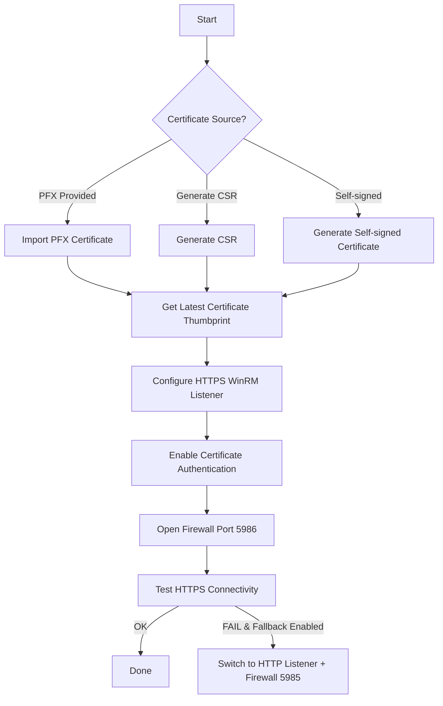

## 📜 Overview

The `inventory/winrm_cert_https/` role automates the secure setup of **WinRM over HTTPS** on Windows hosts, providing a robust and flexible certificate management and listener configuration system. It supports:

* Importing an existing **PFX certificate** for HTTPS WinRM.
* Generating a **Certificate Signing Request (CSR)** for external CA signing.
* Creating a **self-signed certificate** (ideal for testing or lab environments).
* Automatically detecting and using the appropriate certificate thumbprint.
* Configuring the WinRM HTTPS listener bound to the certificate.
* Enabling certificate authentication on WinRM.
* Opening necessary Windows Firewall ports for HTTPS WinRM.
* Optionally falling back to HTTP if HTTPS configuration or connectivity fails.

---

## ⚙️ Variables

All variables are defined with sane defaults in [`defaults/main.yml`](defaults/main.yml) and are fully customizable per environment via inventories or playbooks.

### 🔹 General Configuration

| Variable         | Default                    | Description                                                                                            |
| ---------------- | -------------------------- | ------------------------------------------------------------------------------------------------------ |
| `winrm_hostname` | `{{ inventory_hostname }}` | The hostname or FQDN to be used in the WinRM HTTPS listener and as the certificate's Common Name (CN). |

### 🔹 Certificate Management

| Variable              | Default | Description                                                                                                                                                    |
| --------------------- | ------- | -------------------------------------------------------------------------------------------------------------------------------------------------------------- |
| `winrm_cert_pfx_path` | `""`    | Path to a `.pfx` certificate file on the Ansible control node to import on the Windows host. If empty, CSR generation or self-signed certificate is triggered. |
| `winrm_cert_password` | `""`    | Password for the `.pfx` file. **Must be encrypted with Ansible Vault in production!**                                                                          |
| `winrm_generate_csr`  | `false` | When `true`, the role generates a CSR file on the Windows host for external CA signing.                                                                        |
| `winrm_self_signed`   | `false` | When `true` and no PFX or CSR generation is configured, a self-signed certificate is created automatically.                                                    |

### 🔹 Firewall & Fallback

| Variable                  | Default | Description                                                                                    |
| ------------------------- | ------- | ---------------------------------------------------------------------------------------------- |
| `win_firewall_profile`    | `Any`   | Windows Firewall profile(s) where rules will be applied (e.g., `Domain`, `Private`, `Public`). |
| `winrm_use_http_fallback` | `true`  | Enables fallback to HTTP listener and firewall rule if HTTPS connectivity test fails.          |

---

## 🚀 Usage Example

```yaml
- hosts: windows_servers
  gather_facts: no
  roles:
    - role: winrm_cert_https
      vars:
        winrm_cert_pfx_path: "/path/to/winrm_cert.pfx"
        winrm_cert_password: "{{ vault_winrm_cert_password }}"
        win_firewall_profile: Domain
```

---

## 📊 Certificate Method Decision Table

| Scenario                   | `winrm_cert_pfx_path` | `winrm_generate_csr` | `winrm_self_signed` | Outcome                                                    |
| -------------------------- | --------------------- | -------------------- | ------------------- | ---------------------------------------------------------- |
| **Import PFX certificate** | Non-empty path        | `false`              | `false` or `true`   | Imports `.pfx` file into `LocalMachine\My` store           |
| **Generate CSR**           | Empty                 | `true`               | `false` or `true`   | Creates CSR file at `%TEMP%\winrm_https.req`               |
| **Self-Signed Cert**       | Empty                 | `false`              | `true`              | Generates self-signed cert and imports to store            |
| **Fail**                   | Empty                 | `false`              | `false`             | Role fails with validation error (no cert method selected) |

---

## 🔄 Execution Flow

| Step   | Description                       | File               | Code Location                          |
| ------ | --------------------------------- | ------------------ | -------------------------------------- |
| 0️⃣    | Validate certificate config       | `tasks/assert.yml` | [`assert.yml#L2`](tasks/assert.yml#L2) |
| 1️⃣    | Ensure certificate directory      | `tasks/main.yml`   | [`main.yml#L10`](tasks/main.yml#L10)   |
| 2️⃣    | Copy PFX file to Windows host     | `tasks/main.yml`   | [`main.yml#L15`](tasks/main.yml#L15)   |
| 3️⃣    | Import PFX certificate            | `tasks/main.yml`   | [`main.yml#L25`](tasks/main.yml#L25)   |
| 4️⃣    | Generate CSR (if requested)       | `tasks/main.yml`   | [`main.yml#L35`](tasks/main.yml#L35)   |
| 5️⃣    | Generate self-signed cert         | `tasks/main.yml`   | [`main.yml#L45`](tasks/main.yml#L45)   |
| 6️⃣    | Detect latest cert thumbprint     | `tasks/main.yml`   | [`main.yml#L55`](tasks/main.yml#L55)   |
| 7️⃣    | Set cert thumbprint fact          | `tasks/main.yml`   | [`main.yml#L65`](tasks/main.yml#L65)   |
| 8️⃣    | Configure HTTPS WinRM listener    | `tasks/main.yml`   | [`main.yml#L75`](tasks/main.yml#L75)   |
| 9️⃣    | Enable certificate authentication | `tasks/main.yml`   | [`main.yml#L85`](tasks/main.yml#L85)   |
| 🔟     | Open firewall for WinRM HTTPS     | `tasks/main.yml`   | [`main.yml#L95`](tasks/main.yml#L95)   |
| 1️⃣1️⃣ | Test HTTPS connectivity           | `tasks/main.yml`   | [`main.yml#L105`](tasks/main.yml#L105) |
| 1️⃣2️⃣ | Warn on HTTPS failure             | `tasks/main.yml`   | [`main.yml#L115`](tasks/main.yml#L115) |
| 1️⃣3️⃣ | Remove broken HTTPS listener      | `tasks/main.yml`   | [`main.yml#L120`](tasks/main.yml#L120) |
| 1️⃣4️⃣ | Ensure HTTP listener (fallback)   | `tasks/main.yml`   | [`main.yml#L130`](tasks/main.yml#L130) |
| 1️⃣5️⃣ | Open firewall for WinRM HTTP      | `tasks/main.yml`   | [`main.yml#L140`](tasks/main.yml#L140) |
| 1️⃣6️⃣ | Update runtime inventory vars     | `tasks/main.yml`   | [`main.yml#L150`](tasks/main.yml#L150) |
| 1️⃣7️⃣ | Persist HTTP fallback in hostvars | `tasks/main.yml`   | [`main.yml#L160`](tasks/main.yml#L160) |

---

## 🔐 Security Recommendations

* Always encrypt sensitive variables such as `winrm_cert_password` with [Ansible Vault](https://docs.ansible.com/ansible/latest/user_guide/vault.html):

  ```bash
  ansible-vault encrypt_string 'YourPFXPasswordHere' --name 'winrm_cert_password'
  ```

* Restrict access permissions on `.pfx` certificate files both on the Ansible control node and Windows hosts.

* When using **self-signed certificates** in development, set:

  ```yaml
  ansible_winrm_server_cert_validation: ignore
  ```

  to bypass certificate validation errors.

---

## 🛠 Requirements

* Ansible version 2.10 or higher
* Windows hosts with PowerShell 5.1 or newer
* Python `pywinrm` package installed on the Ansible control node for WinRM connectivity

---

## 📂 Role Structure

```plaintext
roles/
└── winrm_cert_https/
    ├── defaults/
    │   └── main.yml
    ├── files/
    │   └── setup-winrm-https.ps1
    ├── tasks/
    │   ├── assert.yml
    │   └── main.yml
    └── README.md
```

---

## 📌 Additional Notes

* This role does **not** create or manage DNS records. Ensure that `winrm_hostname` resolves correctly via DNS or hosts file.

* CSR generation mode requires you to submit the generated CSR file to a Certificate Authority and import the signed certificate manually or via additional automation.

* The HTTP fallback option is intended for environments where HTTPS setup is problematic or temporary troubleshooting is needed — avoid using HTTP fallback in production environments for security reasons.

---

## 📈 Flowchart Overview



---

If you want me to generate a sample playbook or assist in any specific part of the role or setup, just ask!
