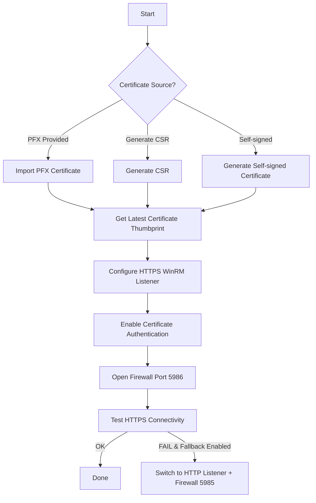

# winrm_cert_https Role

## 📜 Overview
This Ansible role automates the complete setup of **WinRM over HTTPS** on Windows hosts, including:

1. **Installing a certificate** – from a `.pfx` file, a generated CSR, or a self-signed certificate.
2. **Detecting the certificate thumbprint** automatically.
3. **Configuring an HTTPS WinRM listener** bound to the certificate.
4. **Enabling certificate authentication** for WinRM.
5. **Opening the firewall** for WinRM over HTTPS.
6. **Optional HTTP fallback** if HTTPS setup fails.

---

## ⚙️ Variables
All variables are defined in [`defaults/main.yml`](defaults/main.yml) and can be overridden in your inventory or playbooks.

### 🔹 General
| Variable | Default | Description |
|----------|---------|-------------|
| `winrm_hostname` | `{{ inventory_hostname }}` | Hostname or FQDN for the WinRM HTTPS listener and certificate CN. |

### 🔹 Certificate Options
| Variable | Default | Description |
|----------|---------|-------------|
| `winrm_cert_pfx_path` | `""` | Full path to a `.pfx` file on the Ansible control node to copy to the Windows host. Leave empty to trigger CSR or self-signed mode. |
| `winrm_cert_password` | `""` | Password for the `.pfx` file — **must be vaulted** in production. |
| `winrm_generate_csr` | `false` | Set to `true` to generate a CSR (`%TEMP%\winrm_https.req`). |
| `winrm_self_signed` | `false` | Auto-generate a self-signed certificate if no PFX and CSR is requested. |

### 🔹 Firewall and Fallback Options
| Variable | Default | Description |
|----------|---------|-------------|
| `win_firewall_profile` | `Any` | Windows Firewall profile to apply the rule to (`Any`, `Domain`, `Private`, `Public`). |
| `winrm_use_http_fallback` | `true` | If HTTPS fails, configure HTTP listener and update connection vars. |

---

## 🚀 Usage

### Example Playbook
```yaml
- hosts: windows_servers
  gather_facts: no
  roles:
    - role: winrm_cert_https
      vars:
        winrm_cert_pfx_path: "/path/to/winrm_cert.pfx"
        winrm_cert_password: "{{ vault_winrm_cert_password }}"
        win_firewall_profile: Domain
````

---

## 📊 Certificate Method Decision Table

| Scenario             | `winrm_cert_pfx_path` | `winrm_generate_csr` | `winrm_self_signed` | Result                                                         |
| -------------------- | --------------------- | -------------------- | ------------------- | -------------------------------------------------------------- |
| **PFX Import**       | ✅ Non-empty path      | `false`              | `false` or `true`   | [Import `.pfx` into `LocalMachine\My`](tasks/main.yml#L15)     |
| **CSR Generation**   | Empty                 | `true`               | `false` or `true`   | [Generate CSR at `%TEMP%\winrm_https.req`](tasks/main.yml#L30) |
| **Self-Signed Cert** | Empty                 | `false`              | `true`              | [Auto-create self-signed cert](tasks/main.yml#L45)             |
| **Fail**             | Empty                 | `false`              | `false`             | [Fail: no cert method chosen](tasks/assert.yml)                |

---

## 🔄 Execution Flow (Task Mapping)

1. **Fail-fast Validation** – [`tasks/assert.yml`](tasks/assert.yml)
   Ensures at least one certificate method is chosen.

2. **Directory Setup** – [`tasks/main.yml#L10`](tasks/main.yml#L10)
   Creates target folder for certificates.

3. **Certificate Handling**:

   * [Import PFX](tasks/main.yml#L15)
   * [Generate CSR](tasks/main.yml#L30)
   * [Create Self-Signed Cert](tasks/main.yml#L45)

4. **Thumbprint Detection** – [`tasks/main.yml#L60`](tasks/main.yml#L60)

5. **HTTPS Listener Setup** – [`tasks/main.yml#L75`](tasks/main.yml#L75)

6. **Certificate Authentication** – [`tasks/main.yml#L90`](tasks/main.yml#L90)

7. **Firewall Rules** – [`tasks/main.yml#L105`](tasks/main.yml#L105)

8. **Connectivity Test** – [`tasks/main.yml#L120`](tasks/main.yml#L120)

9. **HTTP Fallback** *(optional)* – [`tasks/main.yml#L135`](tasks/main.yml#L135)

---

## 🔐 Security Notes

* Always **vault-encrypt** `winrm_cert_password`:

  ```bash
  ansible-vault encrypt_string 'SuperSecretPass!' --name 'winrm_cert_password'
  ```
* Restrict `.pfx` file access.
* If using self-signed certs, set:

  ```yaml
  ansible_winrm_server_cert_validation: ignore
  ```

---

## 🛠 Requirements

* Ansible `>= 2.10`
* Windows host with PowerShell 5.1+
* Python `pywinrm` installed on control node

---

## 📂 Role Structure

```
roles/
└── winrm_cert_https/
    ├── defaults/
    │   └── main.yml
    ├── files/
    │   └── setup-winrm-https.ps1
    ├── tasks/
    │   ├── assert.yml
    │   └── main.yml
    └── README.md
```

---

## 📌 Notes

* Role does **not** create DNS records — ensure `winrm_hostname` resolves.
* CSR mode requires external signing before importing cert.
---
# WinRM HTTPS Certificate Role

This role automates secure WinRM configuration over HTTPS, with support for:

* Importing an existing **PFX certificate**
* Generating a **Certificate Signing Request (CSR)**
* Creating a **self-signed certificate** (for non-production or lab use)
* Automatic listener and firewall configuration
* Optional HTTP fallback if HTTPS fails

## Repository Location

```
roles/winrm_cert_https/
```

```
roles/winrm_cert_https
├── defaults/main.yml
├── files/setup-winrm-https.ps1
├── tasks/assert.yml
└── tasks/main.yml
```

---

## Usage Flowchart



---

## Decision Table

| Variable(s) Set                   | Path Taken                          |
| --------------------------------- | ----------------------------------- |
| `winrm_cert_pfx_path` (non-empty) | Import PFX certificate              |
| `winrm_generate_csr: true`        | Generate CSR                        |
| `winrm_self_signed: true`         | Generate self-signed cert           |
| None of the above                 | Role fails with configuration error |

---

## Code Navigation

| Step   | Description                        | File               | Link                                                             |
| ------ | ---------------------------------- | ------------------ | ---------------------------------------------------------------- |
| 0️⃣    | Validate certificate configuration | `tasks/assert.yml` | [`assert.yml#L2`](../roles/winrm_cert_https/tasks/assert.yml#L2) |
| 1️⃣    | Ensure cert directory exists       | `tasks/main.yml`   | [`main.yml#L36`](../roles/winrm_cert_https/tasks/main.yml#L36)   |
| 2️⃣    | Import PFX certificate             | `tasks/main.yml`   | [`main.yml#L44`](../roles/winrm_cert_https/tasks/main.yml#L44)   |
| 3️⃣    | Import PFX into store              | `tasks/main.yml`   | [`main.yml#L52`](../roles/winrm_cert_https/tasks/main.yml#L52)   |
| 4️⃣    | Generate CSR                       | `tasks/main.yml`   | [`main.yml#L66`](../roles/winrm_cert_https/tasks/main.yml#L66)   |
| 5️⃣    | Generate self-signed cert          | `tasks/main.yml`   | [`main.yml#L86`](../roles/winrm_cert_https/tasks/main.yml#L86)   |
| 6️⃣    | Get thumbprint                     | `tasks/main.yml`   | [`main.yml#L100`](../roles/winrm_cert_https/tasks/main.yml#L100) |
| 7️⃣    | Save thumbprint fact               | `tasks/main.yml`   | [`main.yml#L109`](../roles/winrm_cert_https/tasks/main.yml#L109) |
| 8️⃣    | Configure HTTPS listener           | `tasks/main.yml`   | [`main.yml#L116`](../roles/winrm_cert_https/tasks/main.yml#L116) |
| 9️⃣    | Enable cert authentication         | `tasks/main.yml`   | [`main.yml#L128`](../roles/winrm_cert_https/tasks/main.yml#L128) |
| 🔟     | Allow HTTPS in firewall            | `tasks/main.yml`   | [`main.yml#L135`](../roles/winrm_cert_https/tasks/main.yml#L135) |
| 1️⃣1️⃣ | Test HTTPS connectivity            | `tasks/main.yml`   | [`main.yml#L148`](../roles/winrm_cert_https/tasks/main.yml#L148) |
| 1️⃣2️⃣ | Warn on failure                    | `tasks/main.yml`   | [`main.yml#L164`](../roles/winrm_cert_https/tasks/main.yml#L164) |
| 1️⃣3️⃣ | Remove broken HTTPS listener       | `tasks/main.yml`   | [`main.yml#L168`](../roles/winrm_cert_https/tasks/main.yml#L168) |
| 1️⃣4️⃣ | Ensure HTTP listener               | `tasks/main.yml`   | [`main.yml#L173`](../roles/winrm_cert_https/tasks/main.yml#L173) |
| 1️⃣5️⃣ | Allow HTTP in firewall             | `tasks/main.yml`   | [`main.yml#L181`](../roles/winrm_cert_https/tasks/main.yml#L181) |
| 1️⃣6️⃣ | Update runtime inventory           | `tasks/main.yml`   | [`main.yml#L191`](../roles/winrm_cert_https/tasks/main.yml#L191) |
| 1️⃣7️⃣ | Persist HTTP fallback              | `tasks/main.yml`   | [`main.yml#L197`](../roles/winrm_cert_https/tasks/main.yml#L197) |

---
