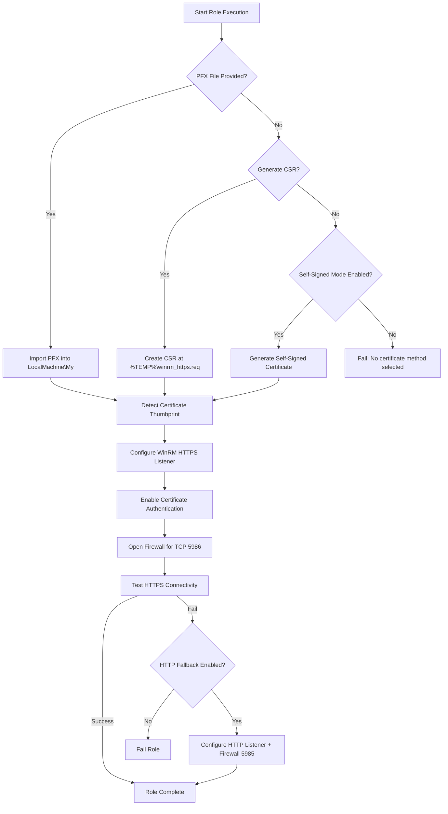

# WinRM HTTPS Certificate Role

## 📜 Overview

This Ansible role automates the full setup of **WinRM over HTTPS** on Windows hosts by:

1. Installing an SSL certificate via:

   * Importing a `.pfx` file,
   * Generating a Certificate Signing Request (CSR),
   * Or creating a self-signed certificate.
2. Automatically detecting the installed certificate’s thumbprint.
3. Configuring a WinRM HTTPS listener bound to that certificate.
4. Enabling certificate-based authentication for WinRM.
5. Opening the Windows Firewall for HTTPS (TCP 5986).
6. Optionally falling back to HTTP if HTTPS configuration or connectivity fails.

---

## ⚙️ Variables

All variables are set with secure defaults in [`defaults/main.yml`](defaults/main.yml) and can be overridden in your inventory or playbooks.

### 🔹 General

| Variable         | Default                    | Description                                           |
| ---------------- | -------------------------- | ----------------------------------------------------- |
| `winrm_hostname` | `{{ inventory_hostname }}` | Hostname/FQDN for the WinRM HTTPS listener & cert CN. |

### 🔹 Certificate Options

| Variable              | Default | Description                                                                            |
| --------------------- | ------- | -------------------------------------------------------------------------------------- |
| `winrm_cert_pfx_path` | `""`    | Path to `.pfx` file on control node to import. Empty triggers CSR or self-signed mode. |
| `winrm_cert_password` | `""`    | Password for the `.pfx` file (vault this in production).                               |
| `winrm_generate_csr`  | `false` | Generate a CSR file at `%TEMP%\winrm_https.req` when true.                             |
| `winrm_self_signed`   | `false` | Create a self-signed cert if no PFX or CSR is provided.                                |

### 🔹 Firewall & Fallback Options

| Variable                  | Default | Description                                              |
| ------------------------- | ------- | -------------------------------------------------------- |
| `win_firewall_profile`    | `Any`   | Firewall profile to apply rules (`Any`, `Domain`, etc.)  |
| `winrm_use_http_fallback` | `true`  | If HTTPS fails, configure HTTP listener and update vars. |

---

## 🚀 Usage Example

```yaml
- hosts: windows_servers
  gather_facts: no
  roles:
    - role: winrm_cert_https
      vars:
        winrm_cert_pfx_path: "/path/to/winrm_cert.pfx"
        winrm_cert_password: "{{ vault_winrm_cert_password }}"
        win_firewall_profile: Domain
```

---

## 🗺 Usage Diagram



---

## 📊 Certificate Method Decision Table

| Scenario             | `winrm_cert_pfx_path` | `winrm_generate_csr` | `winrm_self_signed` | Result                                     |
| -------------------- | --------------------- | -------------------- | ------------------- | ------------------------------------------ |
| **PFX Import**       | Non-empty             | `false`              | `false` or `true`   | Import `.pfx` into `LocalMachine\My` store |
| **CSR Generation**   | Empty                 | `true`               | `false` or `true`   | Generate CSR at `%TEMP%\winrm_https.req`   |
| **Self-Signed Cert** | Empty                 | `false`              | `true`              | Create self-signed certificate for host    |
| **Fail**             | Empty                 | `false`              | `false`             | Role fails with configuration error        |

---

## 🔄 Execution Flow (Task Mapping)

The role proceeds through these steps (linked to `tasks/main.yml`):

1. **Fail-fast Validation** – Verifies certificate method chosen.
2. **Directory Setup** – Ensures folder for cert files exists.
3. **Certificate Handling**:

   * Import `.pfx`
   * OR generate CSR
   * OR create self-signed cert
4. **Thumbprint Detection** – Finds the correct cert thumbprint.
5. **Configure WinRM HTTPS Listener** – Binds listener to certificate.
6. **Enable Certificate Authentication** – For WinRM.
7. **Open Firewall Rule** – Allow inbound TCP 5986.
8. **Connectivity Test** – Validates HTTPS WinRM access.
9. **HTTP Fallback (Optional)** – Setup HTTP listener/firewall if HTTPS fails.

---

## 🔐 Security Notes

* Always encrypt sensitive passwords with Ansible Vault:

  ```bash
  ansible-vault encrypt_string 'SuperSecretPass!' --name 'winrm_cert_password'
  ```

* Restrict `.pfx` file access on control and Windows hosts.

* When using self-signed certs, set in inventory/playbook:

  ```yaml
  ansible_winrm_server_cert_validation: ignore
  ```

---

## 🛠 Requirements

* Ansible 2.10+
* Windows hosts with PowerShell 5.1+
* `pywinrm` Python package on the control node

---

## 📂 Role Structure

```plaintext
roles/
└── winrm_cert_https/
    ├── defaults/
    │   └── main.yml
    ├── files/
    │   └── setup-winrm-https.ps1
    ├── tasks/
    │   ├── assert.yml
    │   └── main.yml
    └── README.md
```

---

## 📌 Additional Notes

* This role does **not** create or manage DNS entries — ensure `winrm_hostname` is resolvable.

* CSR generation mode requires manual CA signing and cert import post-CSR creation.
