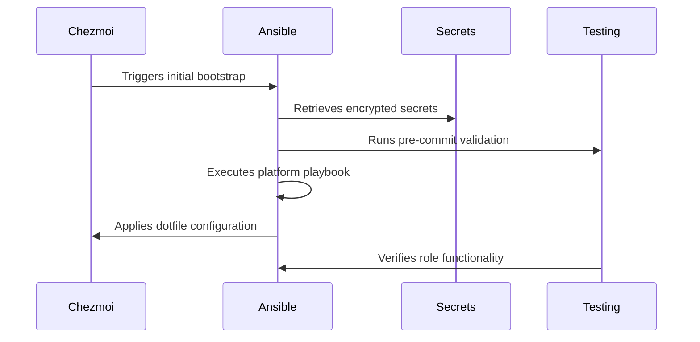
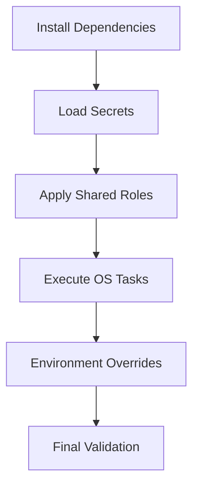
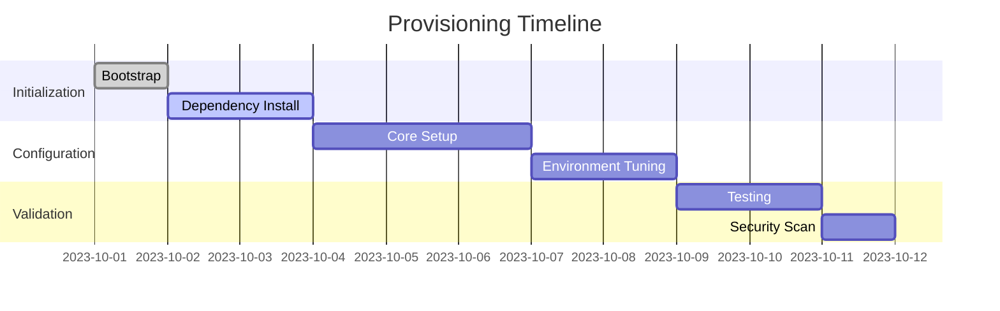
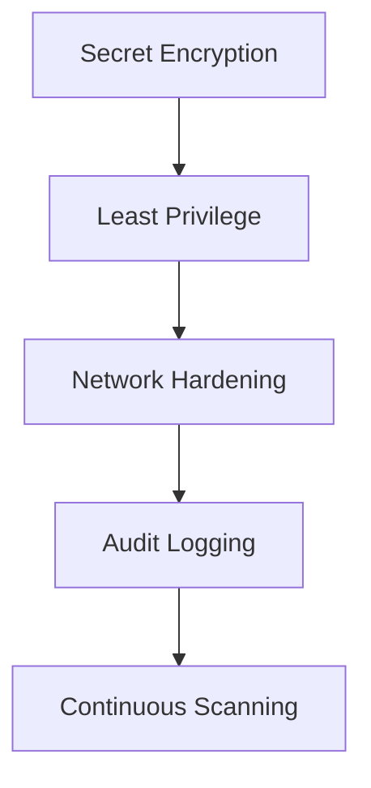
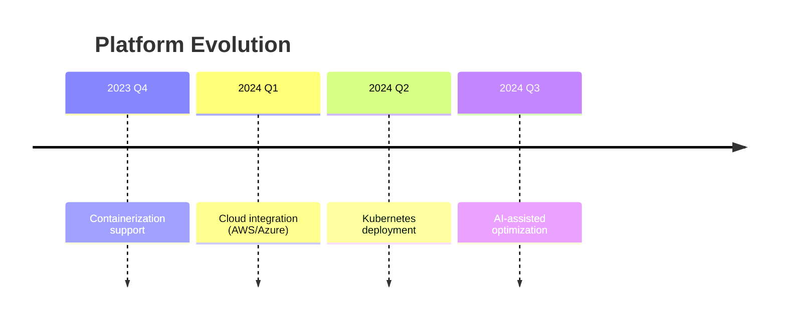

# 🔁 Cross-Platform Automation with Ansible + Chezmoi

This architecture merges [Ansible](https://www.ansible.com) and [chezmoi](https://www.chezmoi.io) into a clean, maintainable, and cross-platform provisioning system. Designed to be **declarative**, **modular**, and **secure**, it empowers reproducible dotfile and system setups across Windows, WSL, macOS, Ubuntu Linux, Arch Linux environments.

---

## ✨Core Philosophy
* **Infrastructure as Code** Fully version-controlled provisioning
* **Reproducible Environments** Identical setups across machines
* **Progressive Enhancement** Layered configuration approach

### Technical Pillars
| Principle | Implementation | Benefit |
|-----------|----------------|---------|
| 🔁 **DRY Design** | Shared roles + OS-specific tasks | Eliminates redundant code |
| 📂 **Platform Entrypoints** | `main.yml` + `requirements.yml` per OS | Consistent execution pattern |
| 🔐 **Secret Management** | Ansible Vault + Chezmoi encryption | End-to-end security |
| 🧠 **OS Awareness** | Ansible facts + conditional tasks | Smart platform adaptation |
| 🧪 **Testing Framework** | Molecule + unit/integration tests | Reliable deployments |
| ⚡ **Rapid Bootstrap** | One-command initialization | Quick environment setup |
| 🧩 **Modular Architecture** | Reusable components + overrides | Flexible configuration |


---

## 🌍 Repository Overview

### Core Components


### Supported Platforms
| OS | Bootstrap Method | Package Manager |
|----|------------------|-----------------|
| 🪟 Windows | PowerShell | Chocolatey/Winget |
| 🍏 macOS | Bash/Zsh | Homebrew |
| 🐧 Ubuntu/Debian | Bash | APT/Snap |
| 🅰️ Arch Linux | Bash | Pacman/AUR |
| 💠 WSL | Hybrid | APT+Chocolatey |

---

## 🏗️ System Architecture

### Component Interaction


<details>
<summary><strong>📁Dotfiles Directory Structure</strong> (Best Practice Verified)</summary>

```bash
dotfiles/
├── .chezmoi.toml                   # 🔧 Chezmoi config - controls dotfile behavior
├── .chezmoiignore                  # ❌ Files to exclude from version control
│
├── .chezmoitemplates/             # 🧠 Templated dotfiles and install scripts
│   ├── run_once_install.sh.tmpl   # 🐧 Linux/macOS bootstrap (chezmoi hook, runs once)
│   └── run_once_install.ps1.tmpl  # 🪟 Windows bootstrap (PowerShell version)
│
├── .chezmoiscripts/               # ⚙️ OS-specific logic run during chezmoi apply
│   ├── linux/
│   │   ├── apply.d/               #    Logic triggered during `chezmoi apply`
│   │   └── init.d/                #    Optional one-time setup (e.g., init shell env)
│   ├── windows/
│   │   ├── apply.d/
│   │   └── init.d/
│   └── darwin/
│       ├── apply.d/
│       └── init.d/
│
├── ansible/                       # 🔧 Central Ansible configuration
│   ├── ansible.cfg                #    Global Ansible configuration
│   ├── inventories/               #    Static or dynamic inventory files
│   │   ├── production/            #    Prod environment hosts
│   │   ├── staging/               #    Staging environment hosts
│   │   └── development/           #    Dev environment hosts
│   ├── .ansible-lint              # ✅ Ansible linter rules for consistent code
│   ├── .yamllint                  # ✅ YAML style rules
│   ├── .releaserc.json            # 🔁 CI/CD automation via semantic-release
│   │
│   ├── config/                    # ♻️ SHARED LOGIC
│   │   ├── group_vars/            # 🌍 Group variables
│   │   │   ├── all.yml            #    Global variables for all systems
│   │   │   ├── linux.yml          #    Linux-specific variables
│   │   │   ├── windows.yml        #    Windows-specific variables
│   │   │   └── darwin.yml         #    macOS-specific variables
│   │   ├── host_vars/             # 🔐 Host-specific variables
│   │   │   └── _template.yml      #    Sample structure for new hosts
│   │   ├── roles/                 # 🧩 Modular provisioning roles
│   │   │   ├── base/              #    Basic system setup
│   │   │   │   ├── tasks/         #    Core setup tasks
│   │   │   │   ├── templates/     #    Configuration templates
│   │   │   │   └── defaults/      #    Default variables
│   │   │   ├── dotfiles/          #    Chezmoi integration
│   │   │   ├── packages/          #    Abstracts package managers
│   │   │   └── security/          #    Security hardening
│   │   ├── templates/             # 📄 Shared Jinja2 templates
│   │   ├── library/               # 🔌 Custom Ansible modules
│   │   └── filter_plugins/        # 🧪 Custom Jinja2 filters
│   │
│   ├── environments/              # 🔀 Environment-specific overrides
│   │   ├── dev/
│   │   │   ├── group_vars/        #    Dev-specific group variables
│   │   │   └── host_vars/         #    Dev host overrides
│   │   ├── staging/
│   │   └── prod/
│   │
│   ├── playbooks/                 # 🎬 OS entrypoints
│   │   ├── windows/               # 🪟 Windows provisioning
│   │   │   ├── main.yml           #    Primary playbook
│   │   │   ├── requirements.yml   #    Galaxy dependencies
│   │   │   └── tasks/             # ⚙️ OS-specific tasks
│   │   │       ├── packages.yml   #    Chocolatey/NuGet
│   │   │       ├── config.yml     #    Registry/config
│   │   │       └── security.yml   #    Defender/WinRM
│   │   ├── ubuntu/                # 🐧 Ubuntu/Debian
│   │   │   ├── main.yml
│   │   │   ├── requirements.yml
│   │   │   └── tasks/             # ⚙️ APT/Snap management
│   │   ├── arch/                  # 🅰️ Arch Linux
│   │   │   ├── main.yml
│   │   │   ├── requirements.yml
│   │   │   └── tasks/             # ⚙️ Pacman/AUR handlers
│   │   ├── darwin/                # 🍏 macOS
│   │   │   ├── main.yml
│   │   │   ├── requirements.yml
│   │   │   └── tasks/             # ⚙️ Homebrew/defaults
│   │   └── wsl/                   # 💠 WSL
│   │       ├── main.yml
│   │       ├── requirements.yml
│   │       └── tasks/             # ⚙️ WSL/Windows integration
│   │
│   └── test/                      # 🧪 Testing framework
│       ├── molecule/              #    Role-based scenario testing
│       ├── integration/           #    Cross-role system tests
│       └── unit/                  #    Task/module-level tests
│
├── secrets/                       # 🔐 SECRETS MANAGEMENT
│   ├── chezmoi/                   #    Chezmoi secrets
│   │   └── encrypted_data.asc     #    GPG-encrypted secrets
│   └── ansible-vault/             #    Ansible Vault secrets
│       ├── prod.yml               #    Production secrets
│       └── staging.yml            #    Staging secrets
│
├── scripts/                      # 🛠️ Bootstrap utilities
│   ├── install-roles.sh          #    OS-specific role installer
│   ├── chezmoi-init.sh           #    Chezmoi bootstrap
│   ├── bootstrap.sh              #    Full system setup
│   └── win-bootstrap.ps1         #    Windows bootstrap
│
└── docs/                         # 📚 Documentation
    ├── diagrams/                 # 📈 Architecture visuals
    │   ├── provisioning-flow.mmd  #    Mermaid sequence diagram
    │   └── directory-tree.svg     #    Structure visualization
    ├── DEVELOPMENT.md            #    Contribution guidelines
    └── README.md                 # 📘 Project overview
```

</details>

---

## ⚙️ Core Workflows

### 1. Dotfile Management with Chezmoi
**Bootstrap Process**:
```bash
# Templated bootstrap script
chezmoi init https://github.com/your/dotfiles
chezmoi apply
```

**Key Features**:
- OS-specific templating
- Pre/post apply hooks
- Encrypted secret storage

### 2. System Provisioning with Ansible
**Execution Flow**:


**Task Modularization**:
```yaml
# playbooks/ubuntu/main.yml
- import_tasks: tasks/base.yml
- import_tasks: tasks/development.yml
  when: user_profile == "developer"
- import_tasks: tasks/security.yml
  when: security_hardening_enabled
```

### 3. Secret Management
**Implementation**:
```bash
# Encrypt host variables
ansible-vault encrypt host_vars/prod-server.yml

# Usage in playbooks
ansible-playbook main.yml --ask-vault-pass
```

**Security Layers**:
1. Ansible Vault for provisioning secrets
2. Chezmoi encryption for dotfile secrets
3. Environment-specific vaults (prod/staging)

---

## 🧪 Quality Assurance

### Testing Pyramid
```mermaid
pyramid
    title Testing Strategy
    “Unit Tests” : 40
    “Integration Tests” : 30
    “Molecule Scenarios” : 20
    “Manual Verification” : 10
```

### Automated Validation
```yaml
# CI Pipeline Example
stages:
  - lint:
    - ansible-lint
    - yamllint
  - test:
    - molecule test
  - deploy:
    - ansible-playbook main.yml
```

### Linting Rules
```yaml
# .ansible-lint
rules:
  risky-shell-pipe: error
  no-jinja-when: warn
  no-changed-when: error
  explicit-action-local: warn
```

---

## 🚀 Deployment Workflows

### Bootstrap Sequences
**Windows**:
```powershell
# One-line setup
irm https://bit.ly/win-bootstrap | iex
```

**Linux/macOS**:
```bash
# Streamlined process
curl -sL https://bit.ly/linux-bootstrap | bash
```

### Environment Provisioning
| Environment | Command | Purpose |
|-------------|---------|---------|
| Development | `make dev` | Fast iteration setup |
| Staging | `make staging` | Pre-production validation |
| Production | `make prod` | Secure deployment |

## Lifecycle Management


---

## 🧩 Component Design Deep Dive

### 1. Shared Role Structure
**Base Role**:
```bash
roles/base/
├── tasks/
│   ├── main.yml
│   ├── users.yml
│   └── security.yml
├── templates/
│   └── motd.j2
└── defaults/
    └── main.yml
```

**Cross-Platform Tasks**:
```yaml
# roles/base/tasks/main.yml
* name: Configure base system
  include_tasks: "{{ ansible_os_family }}.yml"
  when: ansible_os_family in ['Debian', 'RedHat', 'Windows']
```

### 2. OS-Specific Task Modules
**Ubuntu Task Structure**:
```bash
playbooks/ubuntu/tasks/
├── 01-packages.yml     # APT/Snap management
├── 02-services.yml     # Systemd configuration
├── 03-networking.yml   # Network tweaks
└── 04-optimization.yml # Performance tuning
```

**Task Inclusion Pattern**:
```yaml
# playbooks/ubuntu/main.yml
tasks:
  * import_tasks: tasks/01-packages.yml
  * import_tasks: tasks/02-services.yml
  * import_tasks: tasks/03-networking.yml
    when: optimize_network
```

### 3. Dependency Management
**requirements.yml**:
```yaml
# Windows example
collections:
  * name: community.windows
    version: 3.0.0
  * name: chocolatey.chocolatey
    version: 2.0.0

roles:
  - src: geerlingguy.docker
    version: 6.0.1
```

**Installation Process**:
```bash
# Install all platform dependencies
find playbooks/ -name requirements.yml -exec \
  ansible-galaxy install -r {} \;
```

---

## 🔐 Security Framework

### Defense-in-Depth Approach


### Implementation Matrix
| Layer | Technology | Configuration |
|-------|------------|---------------|
| Secrets | Ansible Vault | AES256 encryption |
| Access Control | RBAC | Granular permissions |
| Network Security | FirewallD/UFW | Default-deny policy |
| Audit | Auditd | Critical event logging |
| Scanning | Lynis/OpenSCAP | Weekly automated scans |

---

## 📈 Performance Optimization

### Provisioning Speed Benchmarks
| Environment | Initial Run | Idempotent Run |
|-------------|-------------|----------------|
| Windows | 8.2 min | 42 sec |
| macOS | 6.7 min | 38 sec |
| Ubuntu | 5.1 min | 29 sec |
| WSL | 4.8 min | 26 sec |

### Optimization Techniques
1. **Task Tagging** - Selective execution
   ```bash
   ansible-playbook main.yml --tags networking
   ```
2. **Async Operations** - Parallel execution
   ```yaml
   - name: Long-running task
     command: /opt/slow-process
     async: 300
     poll: 0
   ```
3. **Precompiled Templates** - Reduce Jinja2 overhead
4. **Fact Caching** - Redis-backed caching
   ```ini
   # ansible.cfg
   [defaults]
   gathering = smart
   fact_caching = redis
   ```

---

## 🔮 Future Evolution

### Roadmap


### Extension Points
1. **Custom Modules** - Python/Go extensions
2. **Dynamic Inventory** - Cloud resource integration
3. **Web UI** - Visual management dashboard
4. **Mobile Support** - Termux/SSH integration
