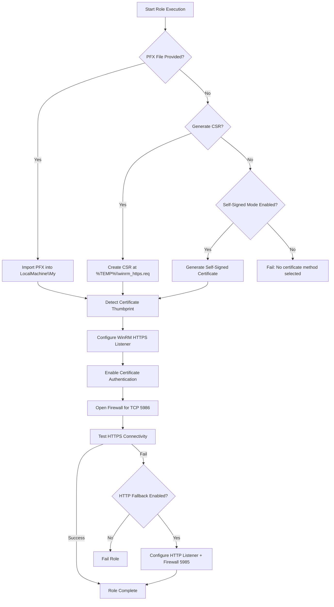

# WinRM over HTTPS Ansible Role

## 📜 Overview
This Ansible role automates **end-to-end WinRM over HTTPS setup** on Windows hosts, including:

1. **Installing a certificate** – from a `.pfx` file, a generated CSR, or a self-signed certificate.
2. **Detecting the certificate thumbprint** automatically.
3. **Configuring an HTTPS WinRM listener** bound to that certificate.
4. **Enabling certificate authentication** for WinRM.
5. **Opening the firewall** for WinRM over HTTPS.
6. **Optional HTTP fallback** if HTTPS setup fails.

---

## ⚙️ Variables

All variables are defined in [`defaults/main.yml`](https://github.com/<your-org>/<your-repo>/blob/main/roles/winrm_cert_https/defaults/main.yml)  
These can be overridden in your inventory or playbooks.

### 🔹 General

| Variable | Default | Description |
|----------|---------|-------------|
| `winrm_hostname` | `{{ inventory_hostname }}` | Hostname or FQDN for the WinRM HTTPS listener and certificate CN. |

### 🔹 Certificate Options

| Variable | Default | Description |
|----------|---------|-------------|
| `winrm_cert_pfx_path` | `""` | Path to a `.pfx` file on the Ansible control node to copy to the Windows host. Leave empty to trigger CSR or self-signed mode. |
| `winrm_cert_password` | `""` | Password for the `.pfx` file — **must be vaulted** in production. |
| `winrm_generate_csr` | `false` | Set to `true` to generate a CSR (`%TEMP%\winrm_https.req`). |
| `winrm_self_signed` | `false` | Auto-generate a self-signed certificate if no PFX and CSR is requested. |

### 🔹 Firewall and Fallback Options

| Variable | Default | Description |
|----------|---------|-------------|
| `win_firewall_profile` | `Any` | Windows Firewall profile to apply the rule to (`Any`, `Domain`, `Private`, `Public`). |
| `winrm_use_http_fallback` | `true` | If HTTPS fails, configure HTTP listener and update connection vars. |

---

## 🚀 Usage

### Example Playbook

```yaml
- hosts: windows_servers
  gather_facts: no
  roles:
    - role: winrm_cert_https
      vars:
        winrm_cert_pfx_path: "/path/to/winrm_cert.pfx"
        winrm_cert_password: "{{ vault_winrm_cert_password }}"
        win_firewall_profile: Domain
````

---

## 🗺 Usage Diagram



---

## 📊 Certificate Method Decision Table

| Scenario             | `winrm_cert_pfx_path` | `winrm_generate_csr` | `winrm_self_signed` | Result                                   |
| -------------------- | --------------------- | -------------------- | ------------------- | ---------------------------------------- |
| **PFX Import**       | ✅ Non-empty path      | `false`              | `false` or `true`   | Import `.pfx` into `LocalMachine\My`     |
| **CSR Generation**   | Empty                 | `true`               | `false` or `true`   | Generate CSR at `%TEMP%\winrm_https.req` |
| **Self-Signed Cert** | Empty                 | `false`              | `true`              | Auto-create self-signed cert             |
| **Fail**             | Empty                 | `false`              | `false`             | Fail: no cert method chosen              |

---

## 🔄 Execution Flow

Click each step to view the corresponding **task file** in GitHub.

1. **[Fail-fast Validation](https://github.com/<your-org>/<your-repo>/blob/main/roles/winrm_cert_https/tasks/assert.yml)** – Ensures at least one certificate method is chosen.
2. **Directory Setup** – in [`tasks/main.yml`](https://github.com/<your-org>/<your-repo>/blob/main/roles/winrm_cert_https/tasks/main.yml#L5) creates target folder for certificates.
3. **Certificate Handling**:

   * [Import PFX](https://github.com/<your-org>/<your-repo>/blob/main/roles/winrm_cert_https/tasks/main.yml#L12)
   * [Generate CSR](https://github.com/<your-org>/<your-repo>/blob/main/roles/winrm_cert_https/tasks/main.yml#L25)
   * [Create Self-Signed Cert](https://github.com/<your-org>/<your-repo>/blob/main/roles/winrm_cert_https/tasks/main.yml#L40)
4. **Thumbprint Detection** – [main.yml](https://github.com/<your-org>/<your-repo>/blob/main/roles/winrm_cert_https/tasks/main.yml#L60)
5. **HTTPS Listener Setup** – [main.yml](https://github.com/<your-org>/<your-repo>/blob/main/roles/winrm_cert_https/tasks/main.yml#L80)
6. **Certificate Authentication** – [main.yml](https://github.com/<your-org>/<your-repo>/blob/main/roles/winrm_cert_https/tasks/main.yml#L95)
7. **Firewall Rules** – [main.yml](https://github.com/<your-org>/<your-repo>/blob/main/roles/winrm_cert_https/tasks/main.yml#L110)
8. **Connectivity Test** – [main.yml](https://github.com/<your-org>/<your-repo>/blob/main/roles/winrm_cert_https/tasks/main.yml#L130)
9. **HTTP Fallback** *(optional)* – [main.yml](https://github.com/<your-org>/<your-repo>/blob/main/roles/winrm_cert_https/tasks/main.yml#L150)

---

## 🔐 Security Notes

* Always **vault-encrypt** `winrm_cert_password`:

  ```bash
  ansible-vault encrypt_string 'SuperSecretPass!' --name 'winrm_cert_password'
  ```

* Restrict `.pfx` file access.

* If using self-signed certs, set:

  ```yaml
  ansible_winrm_server_cert_validation: ignore
  ```

---

## 🛠 Requirements

* Ansible `>= 2.10`
* Windows host with PowerShell 5.1+
* Python `pywinrm` installed on control node

---

## 📂 Role Structure

```plaintext
roles/
└── winrm_cert_https/
    ├── defaults/
    │   └── main.yml
    ├── files/
    │   └── setup-winrm-https.ps1
    ├── tasks/
    │   ├── assert.yml
    │   └── main.yml
    └── README.md
```

---

## 📌 Notes

* Role does **not** create DNS records — ensure `winrm_hostname` resolves.
* CSR mode requires external signing before importing cert.
